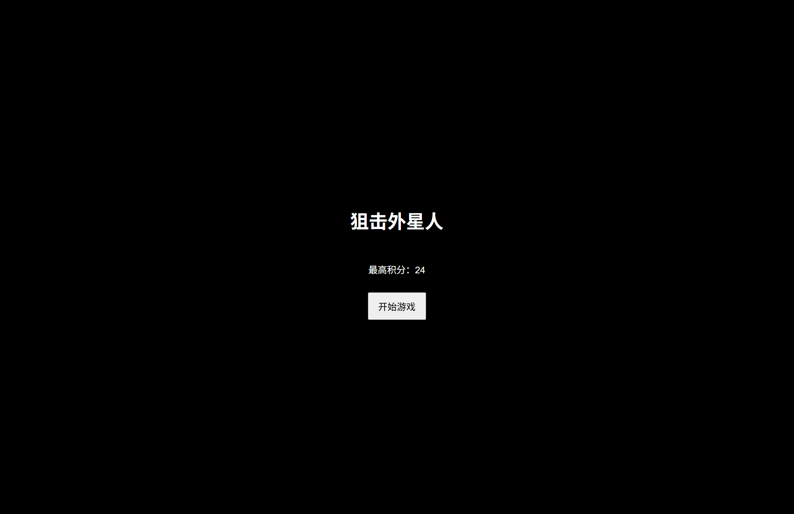
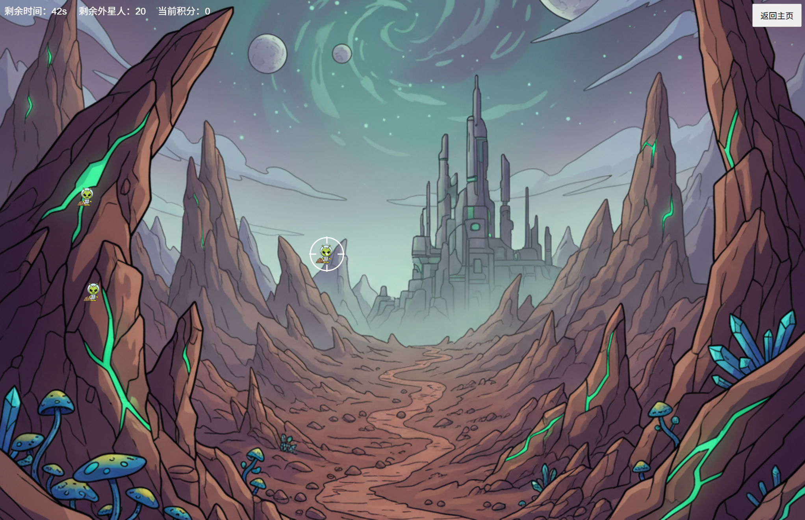

<div align="center">

# 👽 狙击外星人 (Sniping Aliens)

[](LICENSE)
[](https://developer.mozilla.org/en-US/docs/Web/Guide/HTML/HTML5)
[](https://developer.mozilla.org/en-US/docs/Web/CSS)
[](https://developer.mozilla.org/en-US/docs/Web/JavaScript)

一个使用原生 HTML、CSS、JavaScript 开发的简单射击练习游戏。
无任何框架或游戏引擎依赖，纯粹的前端基础练习项目。

<a href="https://houtx.github.io/Project-Sniping-Aliens/" target="_blank">👀 在线预览 (Demo)</a>

</div>

---

## 📸 游戏截图

<div align="center">
  
  
</div>

## ✨ 功能特性

*   **🎯 沉浸式射击体验**：自定义准星系统，跟随鼠标移动，提供真实的瞄准手感。
*   **👾 动态外星人波次**：外星人随机生成，带有脉冲动画（从小变大再变小），考验反应速度。
*   **⏱️ 紧凑的游戏节奏**：50秒倒计时，需要在有限时间内尽可能获得高分。
*   **🏆 动态计分系统**：
    *   命中越快，得分越高（最高 10 分）。
    *   误触扣分机制，防止无脑点击。
    *   本地存储记录历史最高分。
*   **📱 响应式设计**：适配不同屏幕尺寸。

## 🚀 快速开始

### 方式一：直接运行 (推荐)
1.  下载或克隆本项目。
2.  进入项目文件夹。
3.  直接双击 `index.html` 文件即可在浏览器中开始游戏。

### 方式二：本地服务器 (进阶)
如果你想通过本地服务器运行（例如为了避免某些浏览器的跨域限制）：

**Python:**
```bash
python -m http.server 8000
# 访问 http://localhost:8000
```

**Node.js (http-server):**
```bash
npx http-server -p 8000 -c-1
# 访问 http://localhost:8000
```

## 🎮 游戏规则

1.  **开始游戏**：点击首页的"开始游戏"按钮。
2.  **操作**：移动鼠标控制准星，点击鼠标左键射击。
3.  **目标**：在 50 秒内击杀所有目标外星人。
4.  **得分**：
    *   击中外星人：+1~10分 (取决于反应速度)。
    *   未击中/误触：-1分。
5.  **胜利/失败**：
    *   **胜利**：消灭所有外星人，可选择进入下一关（难度增加）。
    *   **失败**：时间耗尽，游戏结束。

## 📂 文件结构

```
Project-Sniping-Aliens/
├── index.html              # 游戏入口 (首页)
├── README.md               # 项目文档
├── assets/                 # 静态资源目录
│   ├── css/
│   │   └── style.css      # 游戏样式表
│   ├── js/
│   │   └── game.js        # 核心游戏逻辑
│   └── images/
│       ├── alien.png      # 外星人素材
│       ├── level.png      # 背景素材
│       └── preview/       # 预览截图
└── pages/
    └── game.html          # 游戏主界面
```

## 🤝 贡献

欢迎提交 Issue 或 Pull Request 来改进这个小游戏！

## 📄 许可

本项目采用 [MIT License](LICENSE) 开源。
仅用于学习与示例，素材请确保合理使用。